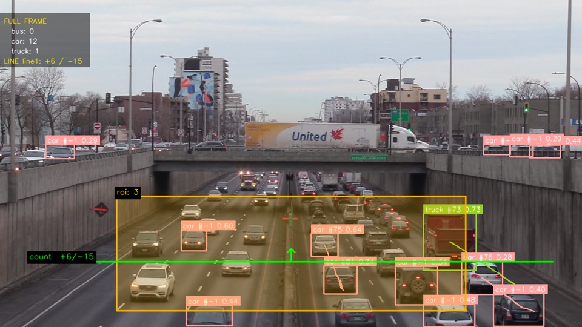
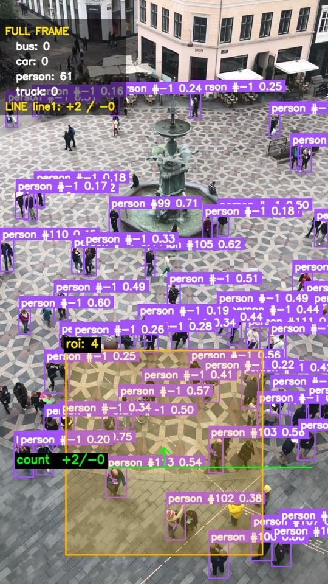
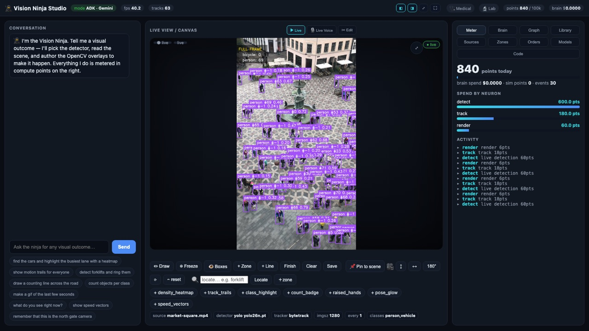
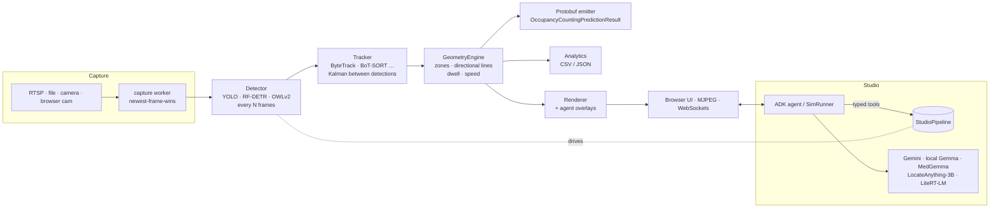

# Occupancy & Traffic Analytics — with an agentic CV studio

[](https://github.com/human81/vision-ninja/actions/workflows/ci.yml)

Real-time occupancy and traffic analytics from any RTSP stream, video file or camera:
**detect → track → spatial math → emit** the Vertex AI Vision
`OccupancyCountingPredictionResult` protobuf, with annotated overlays and a traffic CSV.
It runs at real-time rates on a laptop GPU (Apple Silicon / MPS), and the same code runs on
**Cloud Run — CPU or NVIDIA L4** — behind Firebase sign-in.

On top sits **Vision Ninja Studio**: a Google ADK agent that drives the live pipeline from
chat or voice — it picks detectors, draws zones, authors overlays, answers questions about
the scene and edits clips — with every action metered and visible.

| Traffic: directional line counts + zone occupancy | Crowd: 60+ tracked people |
|---|---|
|  |  |



## Live demo

| Service | URL | Hardware |
|---|---|---|
| CPU | https://vision-ninja-704088323004.us-central1.run.app | 4 vCPU / 8 GiB |
| GPU | https://vision-ninja-gpu-996174958222.us-central1.run.app | NVIDIA L4 · 8 vCPU / 32 GiB |

Both require Google sign-in with an allow-listed account (ask for access). Every route, the
MJPEG stream and the WebSockets are gated — see [Security model](#security-model).

## What it does

- **Counts what matters, correctly.** Zone occupancy (point-in-polygon on each track's
  ground anchor), **directional** line crossings (a true segment∩segment test with a
  right-hand-rule direction — an object passing the line's *extension* is not counted), robust
  per-occupant **dwell** that survives tracker ID switches, and homography **speed**.
- **Real-time on live streams.** Newest-frame-wins capture (latency never builds up),
  detect-every-N with Kalman-predicted tracks in between, auto-reconnect, and a subprocess-
  isolated capture worker so a native FFmpeg crash can't take the server down.
- **Speaks the production contract.** Emits the wire-identical Vertex AI Vision
  `OccupancyCountingPredictionResult` (vendored `.proto`), so downstream consumers don't change.
- **Swappable models.** YOLO (YOLO26/YOLO11, all tasks), RF-DETR, and OWLv2 open-vocabulary
  detection behind one `detect(frame) → supervision.Detections` interface; ByteTrack /
  BoT-SORT / OC-SORT / SORT trackers; LocateAnything-3B for open-vocabulary grounding.
- **An agent you can watch.** The studio's ADK agent calls typed tools against the live
  pipeline; a deterministic SimRunner gives the same experience with **no API key**. Local
  models (Gemma 3 vision, MedGemma, Gemma 4 via LiteRT-LM) run on-device at $0.
- **Runs the same in the cloud.** One image, two variants: CPU, or CUDA on an L4 with the
  local models and sidecars — same weights as the laptop, served cache-only from a bucket.

## Architecture



Three loops share the same core: `occ/pipeline.py` (CLI), `occ/web.py` (dashboard) and
`occ/studio/pipeline.py` (the agent's live loop). Design decisions and trade-offs are written
up in [docs/ARCHITECTURE.md](docs/ARCHITECTURE.md).

## Quickstart (local)

Requires Python 3.12 and [uv](https://github.com/astral-sh/uv). Models download on first use.

```bash
uv venv --python 3.12 .venv
uv pip install -e ".[cv,web,studio]"     # + [face] [seg] [pay] [rfdetr] [vlm] [med] as needed
bash assets/fetch_assets.sh              # 6 test clips → assets/videos/

# real-time pipeline in a window (or --no-show), with protobuf + traffic CSV
.venv/bin/python run.py run --config configs/highway_example.yaml \
    --emit-proto out/run.pb --analytics-csv out/counts.csv

# the studio (+ its local-model sidecars) → http://localhost:8011
.venv/bin/python run.py studio
```

Sign-in is on by default. For local development without Firebase, `STUDIO_AUTH=off` serves
**this machine only** (it refuses any non-loopback or proxied request). Any config field can
be overridden: `--set detector.model=yolo26s.pt --set runtime.detect_every=3`.

Other entry points: `run.py edit` (interactive zone/line editor), `run.py ground`
(open-vocabulary zone suggestions), and the lightweight dashboard
`uvicorn occ.web:app`.

## Cloud Run

```bash
scripts/deploy_cloudrun.sh cpu all        # setup → secrets → build → deploy
scripts/deploy_cloudrun.sh gpu all        # NVIDIA L4 variant (needs L4 quota)
RUN_PROJECT=<project-with-L4-quota> scripts/deploy_cloudrun.sh gpu deploy
scripts/seed_models.sh                    # copy the laptop's model weights to the GPU bucket
```

- **One image, two variants** (`Dockerfile`, `VARIANT=cpu|gpu`). The GPU image adds CUDA
  torch, the local vision models, and the same sidecars `run.py studio` starts on a laptop
  (LocateAnything-3B, LiteRT-LM) — on loopback, sharing the GPU.
- **Exactly one always-on instance.** The studio keeps one live pipeline and agent in process
  memory, so it never scales out; CPU is always allocated so the video loop keeps running.
- **State on a bucket.** Recordings, the media library, settings, saved zones and model
  weights live on a GCS volume at `/app/out`; the container disk is ephemeral.
- **Same weights as the laptop.** `seed_models.sh` uploads the local Hugging Face / LiteRT
  cache; the GPU service runs cache-only (`HF_HUB_OFFLINE=1`) — no rate limits, no gated
  downloads at boot.
- **Host-independent code.** Device selection falls back mps → cuda → cpu; the two ~8.6 GB
  Gemma vision models swap rather than stack in the L4's 24 GB; local models are hidden and
  refused on the CPU service (`STUDIO_LOCAL_MODELS=off`) where they'd exhaust memory.
- **Secrets** come from Secret Manager; `.env` is excluded from every image and upload.

## Security model

The studio runs an agent with powerful tools, so the defaults fail closed:

| Concern | Control |
|---|---|
| Who can use it | Firebase sign-in **on by default** (`occ/studio/auth.py`): ID token → httpOnly session cookie, verified on **every** HTTP route and WebSocket by one ASGI middleware, email-verification enforced server-side, allow-list (`STUDIO_AUTH_ALLOW`; empty = nobody), revocation on sign-out. |
| A deploy that forgets auth | `STUDIO_AUTH=off` only serves loopback clients and refuses proxied requests, so it can't be reachable on Cloud Run. |
| Cross-site WebSockets | Same-origin check on the handshake, on top of the cookie. |
| Agent-written code | `create_overlay` / `run_cv_code` / `run_cv_video` are **off** unless `STUDIO_AGENT_CODE=on` (`occ/studio/codepolicy.py`). The restricted-builtins sandbox stops accidents, not attacks — it can read files — so it's a local-only feature. Built-in presets always work. |
| Prompt → code injection | Chat text is never spliced into generated source raw (sanitized + `repr()`); agent-supplied URLs are passed to yt-dlp after `--`. |
| Payments | With auth on, the Stripe webhook requires a signing secret. |
| Sidecars | Local model servers bind to `127.0.0.1` only. |

## Testing

```bash
.venv/bin/python fishfood.py              # the gate: all clips, levels 1–6
.venv/bin/python fishfood.py --level 2    # quick
.venv/bin/python test_studio_auth.py      # any single suite runs standalone
```

`fishfood.py` climbs from a smoke test to the full matrix — every tracker, analytics, speed,
RF-DETR, protobuf round-trips, a Playwright browser end-to-end, and the studio suites
(auth gate, agent-code policy, cloud readiness, geometry invariants, AR try-on) — and writes
an annotated gallery plus a runbook with the command for each check. CI runs the offline,
CPU-only suites on every push.

## Repository layout

| Path | What |
|---|---|
| `occ/pipeline.py` | The core loop: source → detect-every-N → track → geometry → render → emit |
| `occ/geometry.py` | Zones, directional line crossing, robust dwell |
| `occ/detectors/`, `occ/tracking.py` | Detector backends and tracker factory |
| `occ/sources.py`, `occ/capture_worker.py` | Real-time capture, subprocess-isolated for live streams |
| `occ/emit.py`, `proto/` | The `OccupancyCountingPredictionResult` contract |
| `occ/studio/` | The agentic studio: server, agent, tools, auth, policies, local models |
| `configs/` | One YAML drives everything (💰 marks the cost levers) |
| `Dockerfile`, `cloudbuild.yaml`, `scripts/` | Cloud Run build and deploy |
| `fishfood.py`, `test_*.py` | Tests |

## Limitations

- **Single tenant.** One pipeline and one agent per process, shared by everyone signed in.
  Per-user sessions would mean moving `StudioContext` out of module scope.
- **Agent-written code is local-only** until it runs in a real sandbox (a separate process with
  no secrets or filesystem access).
- **Qwen-Image** (local image editing via stable-diffusion.cpp) is Mac/Metal-only; the cloud
  uses Gemini image models for that.
